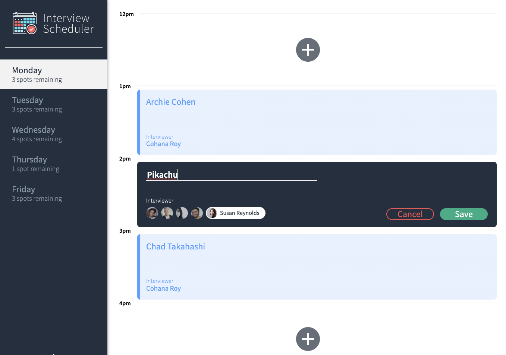

# Interview Scheduler

## About

In this project I was able to create a Week Scheduler using ReactJs, Storybook Visual, Jest Test Framework and making requests to an API using Axios. Additionally, custom hooks were used along useReducer in order to make the application more modular and organized.

## Setup

Install dependencies with `npm install`.

## Running Webpack Development Server

```sh
npm start
```

## Running Jest Test Framework

```sh
npm test
```

## Running Storybook Visual Testbed

```sh
npm run storybook
```

## The Application

The Scheduler has the following structure:


The data is loaded from the API and includes the days (left side of navbar), the appointments (right side of the navbar) and the list of interviewers when you create or edit an appointment.

## Examples

Setting up an interview:


Visualizing after it is saved:


Please note, the spots for the day is automatically updated (rendered by changing the states) once an appointment is created or deleted from the Scheduler.